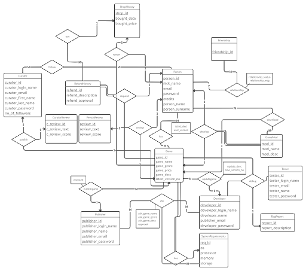

This is a web-based database application for digital video game distribution. Our system consists of 5 user types which are Person, Curator, Publisher, Developer and Tester. Each user type participates in the system with their unique roles.

Persons can purchase games from the store, and after downloading the purchased game, they can review the game. Also, if a person owns a game, he or she can develop mods for that game or download mods made by other persons. At the same time, persons can view curators registered in the system, follow them, and browse through curators' game reviews. As additional features, persons can create a refund request for the game they own, publisher of that game will investigate that refund request. Also, they can add other Persons on the system as friends and gift them games.

Curators can see who is following them. They can also write reviews for games. All persons on the system can view this review.

Developers can create a game request in the system by specifying a name, description, genre and system properties. They can send this request to any publisher they want. If the publisher accepts the game, the game will be added to the store and all persons can view this game. Developers can update their games and see bug reports coming to the game they written by Testers.

Publishers can see game requests from developers in the system. They can accept or decline these game requests. If they agree, they have to set a price for this game. They can also update this price after the game is released. Publishers will also accept or decline persons refund requests. If a refund request gets accepted, that game will be removed from the person's library and the money will be refunded.

Tester user type is an additional user type that we add to the system. Testers can write a bug report to the game they want. This bug report they wrote goes to the developer of the game.

|  | 
|:--:| 
| *er diagram |

[User Manual](user_manual.pdf)
